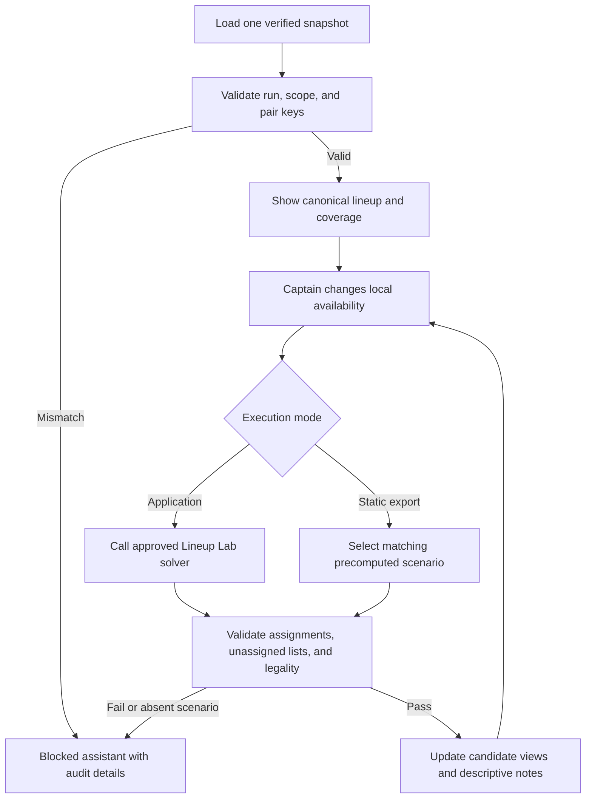

# Captain's Edge Live Assistant

The Captain's Edge Live Assistant is a proposed match-night presentation layer
over already-built, auditable analytics documents. “Live” means the captain can
record local availability and match state during the session. It does not imply
live APA scraping, automatic lineup submission, background network access, or
continuous model retraining.

The assistant coordinates facts; it does not create a new blended decision
score. Its proposed application boundary consumes immutable documents and
produces deterministic view state and notes.

## Inputs

| Input document | Owner | Assistant use |
| --- | --- | --- |
| Team Strength report | proposed `analytics/team_strength.py` | team/session context and separately labeled offense, defense proxy, depth, and composite |
| Player-vs-Player matrix | `analytics/player_vs_player_matrix.py` | complete feasible pairs, evidence labels, current skills, and nested pair summaries |
| Explicit pair summary | `analytics/player_vs_player.py` | selected pair history, reliability, probabilities, and game timeline |
| Player trends | `analytics/player_trends.py` / persisted `PlayerTrend` | slope, sample, trend score, descriptive HOT/COLD/NEUTRAL state |
| Opponent volatility | proposed `analytics/opponent_volatility.py` | separately scoped opponent SL variation and evidence coverage |
| Lineup Lab result | `analytics/lineup_lab.py` | validated current-skill-only assignment, unassigned lists, and 23-rule state |
| Data Coverage report | `analytics/data_coverage.py` | missing skills, evidence denominators, samples, freshness, and unavailable fields |

Every input carries the same run ID, database hash, selected team/opponent,
format, session, and capture time. A scope/hash mismatch blocks the assistant
rather than combining documents from different snapshots.

## Local match state

The assistant may accept these captain-entered facts without changing source
analytics:

- our available/unavailable player IDs;
- opponent available/unavailable player IDs when known;
- completed lineup positions and their real selected pair IDs;
- optional free-text captain notes, clearly labeled user-entered and excluded
  from exports unless explicitly requested.

Availability changes request a new `analytics.lineup_lab.solve` result from the
application boundary using the existing matrix. A static export may instead
switch only among precomputed verified scenarios. Browser JavaScript may not
reimplement the optimizer, fill UNKNOWN edges, or write an inferred result.

## What the captain sees

### Match header

The header fixes team/opponent/format/session, scheduled match identity,
capture time, local-session start time, database/source hash, and a prominent
snapshot-age disclosure. Local time is presentation state and never overwrites
source capture time.

### Anchor candidates

An anchor card is descriptive evidence about a player who appears in the
current Lineup Lab result. It may show:

- current skill and contribution to the 23-rule total;
- current assignment and validated skill-only pairing score;
- trend slope, trend score, indicator, and sample size;
- SL stability/volatility with its scope;
- pair evidence label, DIRECT sample, and history reliability.

There is no hidden anchor score. Default order follows the Lineup Lab
assignment; the captain may sort by one visible field such as stability or
sample size. The selected anchor is a user choice recorded in local state, not
an automated claim that a player should play last.

### Starter candidates

The starter section surfaces the current complete or partial Lineup Lab
assignment with player/opponent identities, current skills, evidence label,
validated skill-only score, and legality contribution. It does not infer actual
APA play order, because the source does not establish one. “Starter” means a
candidate available for the captain's first selection, not a forecast that the
opponent will choose a particular player.

The UI may filter out locally unavailable identities and request a fresh exact
solution. It always keeps the canonical matrix and unassigned lists available
for audit.

### Descriptive risk notes

Risk notes are deterministic disclosures about evidence, not categorical
ratings. Allowed note triggers are:

- pairing is UNKNOWN or lacks a current skill;
- DIRECT history has a small visible sample;
- pair summary and Stage 1 distinct-match counts use different units;
- opponent/player trend or volatility is unavailable or measured over a thin
  sample;
- team-strength component or season projection is unavailable;
- Lineup Lab is partial, illegal, or blocked;
- the snapshot predates a roster/schedule/skill change known to the operator.

Notes quote the source field and value, for example “Opponent SL volatility:
0.42 over 8 readings (not pair-specific).” They cannot say Avoid, Target,
danger, favorable, safe, must-play, or equivalent advice. No note is triggered
from experimental `modeled_win_probability`.

## Screen structure

```text
section#captains-live-assistant
├── match/snapshot header and connection state (offline snapshot)
├── availability controls and local-state timestamp
├── lineup status: complete / partial / blocked and 23-rule verdict
├── starter candidate table
├── anchor candidate cards
├── selected Pair View and match-difficulty heatmap link
├── Team Strength and Season Projection context cards
├── trend and opponent-volatility panels
├── descriptive risk-note feed
└── Data Coverage/provenance drawer
```

The screen is usable offline after build. Controls are keyboard accessible,
status changes use an ARIA live region, and every color has literal text. The
assistant never hides UNKNOWN rows or unavailable players from the audit
drawer.

## State transitions



## Export and audit behavior

An optional session export records source run ID, local state changes, selected
pair IDs, captain-entered choices, and the exact immutable analytics values
shown. It distinguishes `source_fact`, `derived_document`, and `captain_input`.
It does not claim that a displayed candidate was actually played unless the
captain records that fact.

Tests verify scope/hash consistency, exact re-solve behavior, static-scenario
matching, note-template inputs, absence of categorical advice, offline/network
denial, hostile-text escaping, keyboard behavior, and deterministic session
export. The assistant is not production-ready until these tests and a live
operator rehearsal pass.
