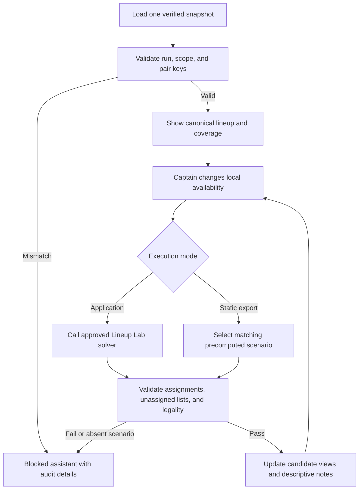

# Captain's Edge Live Assistant

The Captain's Edge Live Assistant is a proposed match-night presentation layer
over already-built, auditable analytics documents. “Live” means the captain can
record local availability and match state during the session. It does not imply
live APA scraping, automatic lineup submission, background network access, or
continuous model retraining.

The assistant coordinates facts; it does not create a new blended decision
score. Its proposed application boundary consumes immutable documents and
produces deterministic view state and notes.

## Architecture boundary

```text
verified immutable analytics documents
    → scope/hash/key reconciliation
    → local availability + captain-entered state
    → approved Lineup Lab re-solve or verified static scenario
    → deterministic Live Assistant view/session document
```

The assistant has no database query, scraper, prediction, or export formula of
its own. The application boundary owns state transitions and exact re-solve
requests; the existing analytics modules retain their formulas. HTML renders
the current view, and any audit workbook renders the session document. A run,
scope, pair-key, or source-hash mismatch fails closed before controls activate.

## Current status and wiring contract

The Live Assistant is not yet implemented. Existing Captain's Edge,
`analytics/captains_edge_summary.py`, legacy lineup-risk, and opponent-scouting
outputs remain separate products; their strongest/danger/high-risk rankings do
not become inputs to this assistant. The assistant composes the verified
documents listed below and never derives a replacement score.

| Planned file | Required public responsibility |
| --- | --- |
| `ui/live_assistant_state.py` | deterministic local state reducer and exact scenario-key generation; no analytics formulas or persistence |
| `ui/tabs/captains_live_assistant.py` | render the offline controls, candidates, descriptive notes, and provenance from one source/session document |
| `scripts/build_captains_live_assistant.py` | reconcile immutable source documents and precompute explicitly configured availability scenarios |
| `ui/export_excel_captains_live_assistant.py` | export an operator-requested local session audit; never modify the build-time workbook |
| full production demo builder | supply common run/scope/hash documents, register the static source artifact, and verify offline behavior |

The build-time source document contains no mutable availability choice. It
records canonical rosters, the complete pair matrix and difficulty cells,
Lineup Lab baseline result, Team Strength, Season Projection context, Trend and
Opponent Volatility rows, Data Coverage, and the allowlisted static-scenario
map. Each scenario key is the sorted set of available player external IDs on
both sides plus exact format/session/team IDs. Missing or duplicate keys fail
the build.

In an application-hosted mode, a state change may call the existing approved
Lineup Lab solver with the exact filtered matrix. In the self-contained demo,
it may select only an exact precomputed scenario. If no scenario matches, the
assistant displays `Scenario unavailable`, preserves the baseline evidence,
and does not approximate a lineup.

The standalone build command contract is:

```text
python scripts/build_captains_live_assistant.py --run-manifest PATH
    --team-id ID --opponent-team-id ID --session NAME --format NAME
    --out-dir PATH [--scenario-file PATH]
```

The input manifest must already be verified, the scenario file is
repository-contained non-secret configuration, and the builder opens all
sources read-only. It cannot scrape, rebuild analytics, or accept mismatched
run IDs/hashes.

## Inputs

| Input document | Owner | Assistant use |
| --- | --- | --- |
| Team Strength report | `analytics/team_strength.py` | team/session context and separately labeled offense, defense proxy, depth, and composite |
| Player-vs-Player matrix | `analytics/player_vs_player_matrix.py` | complete feasible pairs, evidence labels, current skills, and nested pair summaries |
| Explicit pair summary | `analytics/player_vs_player.py` | selected pair history, reliability, probabilities, and game timeline |
| Player trends | `analytics/player_trends.py` / persisted `PlayerTrend` | slope, sample, trend score, descriptive HOT/COLD/NEUTRAL state |
| Opponent volatility | `analytics/opponent_volatility.py` | separately scoped opponent SL variation and evidence coverage |
| Lineup Lab result | `analytics/lineup_lab.py` | validated current-skill-only assignment, unassigned lists, and 23-rule state |
| Data Coverage report | `analytics/data_coverage.py` | missing skills, evidence denominators, samples, freshness, and unavailable fields |

Every input carries the same run ID, database hash, selected team/opponent,
format, session, and capture time. A scope/hash mismatch blocks the assistant
rather than combining documents from different snapshots.

## Local match state

The assistant may accept these captain-entered facts without changing source
analytics:

- our available/unavailable player IDs;
- opponent available/unavailable player IDs when known;
- completed lineup positions and their real selected pair IDs;
- optional free-text captain notes, clearly labeled user-entered and excluded
  from exports unless explicitly requested.

Availability changes request a new `analytics.lineup_lab.solve` result from the
application boundary using the existing matrix. A static export may instead
switch only among precomputed verified scenarios. Browser JavaScript may not
reimplement the optimizer, fill UNKNOWN edges, or write an inferred result.

## What the captain sees

### Match header

The header fixes team/opponent/format/session, scheduled match identity,
capture time, local-session start time, database/source hash, and a prominent
snapshot-age disclosure. Local time is presentation state and never overwrites
source capture time.

### Anchor candidates

An anchor card is descriptive evidence about a player who appears in the
current Lineup Lab result. It may show:

- current skill and contribution to the 23-rule total;
- current assignment and validated skill-only pairing score;
- trend slope, trend score, indicator, and sample size;
- SL stability/volatility with its scope;
- pair evidence label, DIRECT sample, and history reliability.

There is no hidden anchor score. Default order follows the Lineup Lab
assignment; the captain may sort by one visible field such as stability or
sample size. The selected anchor is a user choice recorded in local state, not
an automated claim that a player should play last.

### Starter candidates

The starter section surfaces the current complete or partial Lineup Lab
assignment with player/opponent identities, current skills, evidence label,
validated skill-only score, and legality contribution. It does not infer actual
APA play order, because the source does not establish one. “Starter” means a
candidate available for the captain's first selection, not a forecast that the
opponent will choose a particular player.

The UI may filter out locally unavailable identities and request a fresh exact
solution. It always keeps the canonical matrix and unassigned lists available
for audit.

### Descriptive risk notes

Risk notes are deterministic disclosures about evidence, not categorical
ratings. Allowed note triggers are:

- pairing is UNKNOWN or lacks a current skill;
- DIRECT history has a small visible sample;
- pair summary and Stage 1 distinct-match counts use different units;
- opponent/player trend or volatility is unavailable or measured over a thin
  sample;
- team-strength component or season projection is unavailable;
- Lineup Lab is partial, illegal, or blocked;
- the snapshot predates a roster/schedule/skill change known to the operator.

Notes quote the source field and value, for example “Opponent SL volatility:
0.42 over 8 readings (not pair-specific).” They cannot say Avoid, Target,
danger, favorable, safe, must-play, or equivalent advice. No note is triggered
from experimental `modeled_win_probability`.

## Screen structure

```text
section#captains-live-assistant
├── match/snapshot header and connection state (offline snapshot)
├── availability controls and local-state timestamp
├── lineup status: complete / partial / blocked and 23-rule verdict
├── starter candidate table
├── anchor candidate cards
├── selected Pair View and match-difficulty heatmap link
├── Team Strength and Season Projection context cards
├── trend and opponent-volatility panels
├── descriptive risk-note feed
└── Data Coverage/provenance drawer
```

The screen is usable offline after build. Controls are keyboard accessible,
status changes use an ARIA live region, and every color has literal text. The
assistant never hides UNKNOWN rows or unavailable players from the audit
drawer.

## HTML and session workbook

The planned self-contained HTML embeds only verified source documents and
manifest-approved static scenarios. Its local state is initialized empty and
never written back to the source database. Availability toggles, selected
pairs, and captain notes carry literal `captain_input` labels; source values
remain read-only. A printable audit drawer lists the active scenario, all
unassigned identities, the 23-rule result, source run/hash, and every note
trigger/value.

If session export is enabled, `captains_live_assistant.xlsx` contains values-only
sheets:

- `Assistant_Session`: run/scope/hash, session start, snapshot capture time,
  final local state, Lineup Lab status, legality result, and export time;
- `Availability_Events`: monotonic event sequence, local timestamp, player ID,
  side, prior state, new state, and `captain_input` source type;
- `Candidate_View`: the exact ordered candidate/pair rows and immutable source
  values displayed for the exported state;
- `Risk_Notes`: deterministic note key, literal rendered note, source field,
  source value, sample/coverage, and source type.

The workbook contains no formulas, macros, external links, hidden sheets, or
claim that a candidate was played. Empty event/note sheets retain headers and a
manifest-declared zero count. IDs remain text, timestamps are ISO 8601 with
offset, and row order follows event sequence or delivered candidate order.

## State transitions



## Export and audit behavior

An optional session export records source run ID, local state changes, selected
pair IDs, captain-entered choices, and the exact immutable analytics values
shown. It distinguishes `source_fact`, `derived_document`, and `captain_input`.
It does not claim that a displayed candidate was actually played unless the
captain records that fact.

Tests verify scope/hash consistency, exact re-solve behavior, static-scenario
matching, note-template inputs, absence of categorical advice, offline/network
denial, hostile-text escaping, keyboard behavior, and deterministic session
export. The assistant is not production-ready until these tests and a live
operator rehearsal pass.

## Demo integration

The Live Assistant opens after Team Strength and Season Projection context has
been established. The presenter toggles one known player unavailable, shows the
exact approved re-solve/static-scenario match, opens one candidate's Pair View,
and traces a descriptive trend or volatility note to its source panel. They
then restore availability and verify the canonical lineup/state returns.

The full demo builder creates the immutable source document and any approved
static scenarios; the launcher merely opens the verified page. A session
workbook is produced only after an explicit operator export action and is
registered separately from build-time artifacts. Demo acceptance requires
offline operation, complete UNKNOWN/unassigned visibility, HTML/session-export
parity, and proof that no local action mutates the database or source bundle.
