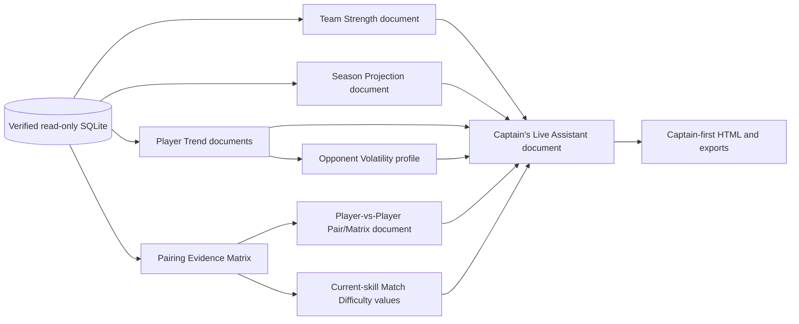

# APA Tracker production-demo architecture

This blueprint describes the demo as a reproducible, read-only presentation of
one freshly regenerated APA snapshot. The demo never becomes a second data
pipeline: it calls the same scraper, ingest, analytics, and export boundaries
used by the normal application and serves the resulting self-contained files.

## System map

```text
APA portal
   │ authenticated browser/API session
   ▼
auth/ ──► scraper/ ──► scraper fixtures (raw GraphQL JSON, gitignored)
                         │
                         ├─ parser/apa_graphql.py (payload → typed rows)
                         └─ parser/html_parser.py + apa_page_map.py (legacy HTML)
                                      │
                                      ▼
                         scheduler/graphql_sync.py
                         or pipeline.ingest.run (fixture mode)
                                      │
                                      ▼
                         database/ (SQLite + SQLAlchemy)
                                      │
            ┌─────────────────────────┼────────────────────────┐
            │                         │                        │
            ▼                         ▼                        ▼
 analytics documents       general export builders      ui/tabs shell
 ├─ Player-vs-Player       ├─ ui/export_json.py         ├─ Pair/Matrix
 ├─ Data Coverage          ├─ ui/export_excel.py        ├─ Lineup Lab
 ├─ Player Trends          └─ scripts/build_*           ├─ Data Coverage
 ├─ Season Projection                                  ├─ Team/Season
 ├─ Team Strength analytics                            └─ Live Assistant
 └─ planned Opponent Volatility
            │                         │                        │
            └─────────────────────────┼────────────────────────┘
                                      ▼
                         exports/ (HTML, JSON, XLSX)
                                      │
                                      ▼
                         planned ui/router.py + full demo builder
                         unified launcher / browser walkthrough
```

## Component responsibilities

### Authentication and scraping

- `auth/session_manager.py`, `auth/login.py`, and `auth/graphql_client.py`
  own credentials, session state, and GraphQL transport.
- `scraper/full_auto_scrape.py` and `scraper/full_apa_scrape.py` perform the
  authenticated entity walk. `scraper/graphql_scraper.py` turns captured
  operations into normalized rows; the team, match, player, and league modules
  are route-specific helpers.
- Authentication material stays in memory or in ignored local files. No token,
  cookie, password, or raw authenticated response belongs in a demo artifact.

### Parsing and contracts

- `parser/apa_graphql.py` is the source-aware parser for captured GraphQL
  shapes. It is the contract used by both live sync and fixture ingest.
- `parser/html_parser.py` and `parser/apa_page_map.py` support the older HTML
  path; they are not a replacement for the authenticated GraphQL team path.
- The fixture directory is an interface boundary. A fixture build and a live
  build must enter the same downstream functions after parsing.

### Scheduling and ingestion

- `scheduler/graphql_sync.py` is the live, direct-token path. `daily_sync.py`
  and `weekly_refresh.py` are scheduled wrappers.
- `pipeline_run_all.py` is the end-to-end operator entry point: scrape, invoke
  `python -m pipeline`, then run tests.
- `pipeline/__main__.py` and `pipeline/ingest.py` provide an offline,
  fixture-backed path for CI and rehearsals. Ingest order is teams/rosters/
  standings/schedules, scoresheets, head-to-head rows, team history, matchup
  aggregates, then Head-to-Head Advantage and Player Trends.

### Database

- `database/models.py` defines the ten current tables and their identity and
  nullability rules.
- `database/engine.py` creates SQLite tables and fails closed when an existing
  database lacks a model column. There is intentionally no in-place migration;
  source rows are re-fetchable, so regeneration is safer and auditable.
- `database/ingest.py` is the only write boundary. `database/queries.py` is
  the read/query boundary, including canonical current-roster resolution used
  by the captain-first experience.

### Analytics

The demo-relevant analytics are pure functions over persisted rows or already
built documents:

- `analytics.player_stats.py`, `team_stats.py`, and
  `skill_level_trends.py` describe real records and skill movement.
- `analytics.matchups.py` and `matchup_builder.py` aggregate exact-player
  head-to-head history into `player_matchups`.
- `analytics.head_to_head.py` writes `player_h2h_advantage`, including the
  validated skill-only probability used by Stage 1/3.
- `analytics.pairing_evidence.py` classifies each feasible pairing as
  DIRECT, INDIRECT, or UNKNOWN and reconciles the complete matrix.
- `analytics.lineup_legality.py` applies the real APA five-player/23-rule
  calculation. `analytics.lineup_lab.py` uses the approved skill-only score,
  exact matching, and explicit unassigned lists.
- `ui/tabs/tonights_match.py` is the static captain-first reporter. Stage 3
  HTML wiring currently includes Lineup Lab; Data Coverage remains a planned
  follow-up.
- `analytics/player_vs_player.py` supplies a pure explicit-pair summary over
  chronological `PlayerHeadToHead` rows: recognized-game record, skill delta,
  shared history reliability, last-recorded skill-only probability, full
  modeled probability, whole/recent pair trends, an identical forward
  projection alias, and the game timeline.
- `analytics/player_vs_player_matrix.py` is the separate whole-matrix adapter.
  It accepts one existing `PairingEvidenceMatrix` and a map of already-fetched
  exact-pair histories, invokes the explicit-pair summary once per feasible
  pair, and returns stable `PlayerVsPlayerExportRow` values. It performs no SQL
  and no new analytics. Unsupported innings,
  per-opponent defense, break/run rate, and numeric volatility remain explicit
  gaps; there is no export-layer blended score.
- `analytics/data_coverage.py` accepts one already-built matrix plus real
  standings/career refresh timestamps. It produces named missing skills,
  DIRECT/INDIRECT/UNKNOWN counts and percentages, one sample-size row per pair,
  timestamps, and fixed unavailable-field disclosures without opening the
  database or recreating evidence labels. `docs/data_coverage.md` is its exact
  contract. General schema/run/hash and Lineup Lab reconciliation remain
  orchestrator/manifest responsibilities.
- `analytics/player_trends.py` owns regression slope, last-20 skill-level
  volatility, stability, the gated descriptive HOT/COLD/NEUTRAL indicator, and
  `trend_score`. `analytics/trend_analyzer.py` composes its implemented
  immutable presentation report and calls the public score function; it does
  not introduce a second trend formula.
- `analytics/season_projection.py` owns the existing team-level log5 baseline,
  expected remaining wins/losses, upset-likelihood number, and deduplicated
  standings-history curve. It never simulates a future player lineup.
- Implemented `analytics/team_strength.py` consumes canonical team/session roster
  records and finalized team scores to produce separately auditable offense,
  defense-proxy, depth, and equal-component strength indices. A missing
  component makes the composite null. Its standalone read-only builder and
  HTML/Excel renderers exist; production provenance, stricter ambiguity/scope
  guards, and full-demo registration remain planned.
- Implemented `analytics/opponent_volatility.py` transforms the existing player
  trend volatility to a bounded descriptive index and median opponent-team
  profile. It is explicitly player/format/session scoped, not pair-specific.
  Its standalone read-only builder and HTML/Excel baseline exist; richer UX,
  provenance, pair/live joins, and full-demo wiring remain.
- The Match Difficulty Heatmap uses the shared validated current-skill-only
  function and current matrix skills. It never colors from the experimental
  history-blended probability.

The legacy `win_probability`, `lineup_optimizer`, `lineup_risk`,
`opponent_scouting`, `rationale`, and summary paths remain
documented but are not presented as validated captain-first advice until their
Issue #14 findings are corrected and re-audited. Season Projection is allowed
only as the descriptive, assumption-labeled team baseline in its own contract.

### UI and exports

- `ui/export_json.py` and `ui/export_excel.py` publish the general data
  products (`apa_data.json`, `apa_stats.xlsx`).
- `scripts/build_captains_edge.py` publishes Captain's Edge HTML/JSON/XLSX;
  `scripts/build_lineups.py` publishes `lineups.json` for its separate legacy
  optimizer view.
- `scripts/build_captain_first_edge.py` publishes
  `captain_first_edge.html`, which is the production-demo entry view.
- `pipeline/exports.py` writes `analysis_tabs.html` after the builders, so the
  static tabs see committed JSON documents rather than an uncommitted session.
- Implemented `ui/export_html_player_vs_player.py` and
  `ui/export_excel_player_vs_player.py` render `player_vs_player.html`/`.xlsx`
  from the same matrix rows. The HTML reuses `ui/tabs/player_vs_player.py` for
  each explicit detail.
- `ui/tabs/player_vs_player_unified.py` implements one Player vs Player fragment
  with Pair View and Matrix View subviews over the same rows and escaped script
  JSON. Pair View renders one nested
  `PlayerVsPlayerSummary`; Matrix View renders the ordered
  `PlayerVsPlayerExportRow` collection. Existing `ui/tabs` composition owns the
  shell, while analytics ownership stays in the two separate modules. The full
  persistent URL/history contract below remains the routing target.
- Planned `ui/router.py` uses one `player-vs-player` route with `view=pair` or
  `view=matrix`. A pair route also requires both external player IDs and the
  complete scope. Invalid state fails back to Matrix View with an explanation;
  it never resolves identity from names.
- The planned Full Production Demo Builder's Player-vs-Player phase invokes the
  existing read-only builder once, serializes the ordered rows and nested
  summaries into escaped `pvp-data` script JSON, and registers/verifies the
  HTML/XLSX without duplicating ingest. Planned
  `exports/html_builder.py` and `exports/excel_builder.py` delegate to the
  existing renderers.
- `ui/tabs/data_coverage.py`, `ui/export_excel_data_coverage.py`, and
  `scripts/build_data_coverage.py` consume one `DataCoverageReport` and emit
  `data_coverage.html`/`.xlsx`; unified demo wiring remains planned. Links from
  Player vs Player, Lineup Lab, and Captain's Edge may select an existing
  evidence/missing-skill/sample/gap section but cannot mutate the report.
- Team Strength now has standalone HTML and a values-only workbook from the
  implemented immutable report. Season Projection likewise has a
  standalone read-only builder plus HTML/Excel renderers, with unified-demo
  provenance and parity still pending. The richer Trend Analyzer likewise has
  an immutable adapter and standalone HTML/Excel builder; selected-history UX
  and full-demo wiring remain. Opponent Volatility likewise reuses those trend
  facts and has standalone HTML/Excel; richer UX and full-demo wiring remain.
- Planned `scripts/build_full_production_demo.py` coordinates acquisition,
  ingest, document construction, exports, and verification without launching a
  browser. Planned `scripts/run_production_demo.py` is the thin operator
  launcher and may serve only a verified READY bundle on loopback.

### Extended analytics composition



Every arrow passes a versioned immutable document with the same run/scope/hash.
The Live Assistant coordinates views and local availability state; it does not
blend a new score or turn descriptive inputs into categorical advice.

The implementation-ready ownership, current status, dependency order, and
cross-artifact gates for this extended path are consolidated in
`remaining_analytics_wiring_plan.md`.

### Unified Player vs Player data flow

```text
PairingEvidenceMatrix + exact head_to_head_history map
                │
                ▼
analytics/player_vs_player_matrix.py
                │ ordered PlayerVsPlayerExportRow values
                ├───────────────┬────────────────────┐
                ▼               ▼                    ▼
Matrix View       Pair View selection       Captain's Edge profile
all rows           one row.summary           selected descriptive facts
                └───────────────┬────────────────────┘
                        ▼
          escaped script JSON + ui/tabs shell
```

The browser reads `script#pvp-data` once, validates its schema version and pair
keys, and performs presentation-only selection/filtering. It cannot query the
database, call analytics, fill nulls, create categorical risk fields, or blend
a hidden score.

Captain's Edge references the same selected matrix row for its Opponent Risk
Profile. It displays sourced facts and may order opponents by one named visible
field at a time, with nulls last and canonical identity tie-breaks. Its schema
contains no Avoid/Target, danger/favorable, tier, traffic-light, or other
categorical risk field, and the browser cannot blend a hidden score. Capture
time and availability state travel with the row so the profile cannot
masquerade as a live evaluation.

### Unified-tab routing contract

The `player-vs-player` top-level tab owns both subviews. A scope-only URL or an
explicit `view=matrix` opens Matrix View. A Details action writes `view=pair`,
`player_id`, and `opponent_id` while preserving team, opponent-team, format,
and session scope. The pair key must match exactly one row in the embedded
snapshot. Missing, duplicate, or out-of-scope IDs return to Matrix View and
show an inline routing error; display names are never identity inputs.

The router stores the active subview, pair key, matrix filters, named sort field,
and sort direction in URL state so Back/Forward restores the same presentation.
It validates all state against `script#pvp-data`, never refetches or recomputes
analytics, and ignores unknown query keys. A “Back to Matrix” action restores
the prior filter/sort state rather than constructing a second tab.

## Demo boundary and invariants

The production builder may create a scratch output directory and regenerated
SQLite file. The launcher may start only a loopback presentation process after
verification. Neither may mutate source code, tests, committed fixtures, or the
user's credential files. Every displayed number must identify a raw field,
documented aggregation, or approved formula. Missing evidence is rendered as
“No data” or an unavailable scope; it is never converted to a plausible zero
or 50/50 value.

The critical invariants are:

1. `DIRECT + INDIRECT + UNKNOWN = feasible pairings` by pair identity.
2. Assigned plus unassigned players/opponents equals each side's available
   roster.
3. A complete five-player Lineup Lab result has a real legality verdict.
4. Player vs Player HTML and Excel contain the same matrix pair keys and values
   in canonical order, UNKNOWN included; each embedded explicit-pair detail
   matches its source row and chronological game records.
5. All artifacts in one demo run share one database and one source manifest.
6. A failed preflight or stale schema stops the run before presentation.
7. Data Coverage label percentages use total feasible pairings as their
   explicit denominator; counts, percentages, missing skills, sample rows, and
   timestamps agree across HTML, Excel, and manifest before rounding.
8. Team Strength is null unless offense, defense proxy, and depth are all
   present; HTML/Excel expose each raw denominator and formula version.
9. Heatmap pair keys equal matrix pair keys. Null current skills remain hatched
   `No data`, and the experimental blended probability never supplies color.
10. Season Projection includes every real remaining match, even when its
    probability is null, and never claims a future player lineup or final rank.

## Build modes

| Mode | Purpose | Network | Expected data |
| --- | --- | --- | --- |
| Live production | Rehearsal/presentation from current league data | Authenticated APA access | Fresh rosters, schedule, scores, TeamStat history |
| Fixture CI | Repeatable pull-request/nightly validation | None | Committed sample fixtures; captain-first roster may be unavailable by design |
| Empty/stale guard | Failure-path proof | None | Missing DB or stale schema; explicit error artifact, no advice |
