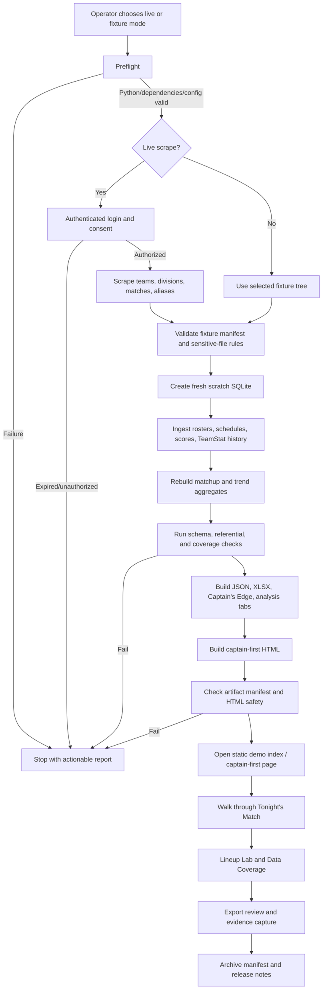

# Production demo flow diagram

The production demo is a one-way, fail-closed flow. The browser is opened only
after the data build and artifact checks succeed.

## Operator timeline

1. Select a mode and output directory. The production launcher must require
   an explicit choice so a rehearsal cannot silently make a live network call.
2. Run preflight: repository root, Python 3.12/3.13, pinned dependencies,
   Playwright browser (live mode), config, output permissions, and absence of
   credentials in the output tree.
3. In live mode, complete login and the guarded “Continue to Member Services”
   consent step. In fixture mode, verify the fixture manifest instead.
4. Build a new database in scratch space. Never reuse an old database merely
   because it exists; an older file can lack `player_team_history.team_external_id`.
5. Ingest and rebuild analytics. Commit timestamps, source IDs, and row counts
   to the run manifest.
6. Build all artifacts, validate containment under the chosen output directory,
   and run the smoke assertions before opening a browser.
7. Present `captain_first_edge.html` first, then the analysis tabs and workbook.
8. Preserve the manifest and checksums as the demo evidence package. Remove
   temporary credentials and browser state; retain only approved outputs.

## Failure branches

- Authentication failure: stop; do not fall back to a stale database.
- Missing current-roster identity: keep the real scope visible as unavailable;
  do not infer membership from historical `PlayerMatch` rows.
- Stale schema: report the missing model columns and require regeneration.
- No scoreable Lineup Lab edges: show the matrix and explicit unassigned lists;
  do not manufacture a lineup.
- HTML or artifact validation failure: do not open the page as a “best effort.”

