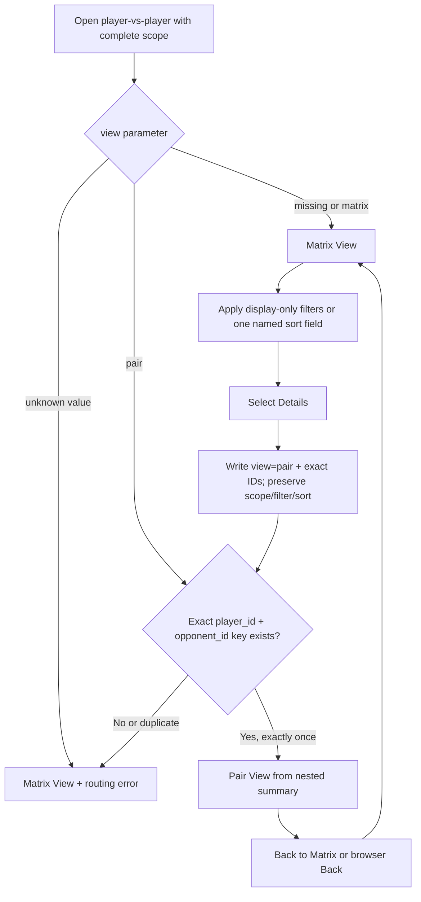

# Production demo flow diagram

The production demo is a one-way, fail-closed flow. The browser is opened only
after the data build and artifact checks succeed.

```mermaid
flowchart TD
    A[Operator chooses live or fixture mode] --> B[Preflight]
    B -->|Python/dependencies/config valid| C{Live scrape?}
    B -->|Failure| Z[Stop with actionable report]
    C -->|Yes| D[Authenticated login and consent]
    C -->|No| E[Use selected fixture tree]
    D -->|Authorized| F[Scrape teams, divisions, matches, aliases]
    D -->|Expired/unauthorized| Z
    F --> G[Validate fixture manifest and sensitive-file rules]
    E --> G
    G --> H[Create fresh scratch SQLite]
    H --> I[Ingest rosters, schedules, scores, TeamStat history]
    I --> J[Rebuild matchup and trend aggregates]
    J --> K[Run schema, referential, and coverage checks]
    K -->|Fail| Z
    K --> LOCK[Lock database hash and reopen read-only]
    LOCK --> L[Build general JSON, XLSX, and analysis tabs]
    L --> PVPA[Build Player vs Player Matrix and current-skill heatmap cells]
    PVPA --> EXT[Build Team Strength, Season Projection, and Trend document]
    EXT --> OV[Build Opponent Volatility profiles]
    OV --> DCA[Build Lineup Lab and denominated Data Coverage]
    DCA --> LIVE[Build Captain's Edge composition and Live Assistant scenarios]
    LIVE --> RENDER[Render all HTML, Excel, and parity JSON]
    RENDER --> N[Check HTML/workbook safety and cross-export parity]
    N -->|Fail| Z
    N --> FIN[Write and verify manifest plus checksums]
    FIN --> READY[Write READY last]
    READY --> LV[Unified launcher independently revalidates exact run]
    LV -->|Fail| Z
    LV --> O[Optional loopback serve and open static index]
    O --> P[Walk through Tonight's Match]
    P --> PVPT[Open unified Player vs Player tab]
    PVPT --> PVPMV[Matrix View: inspect every feasible pair]
    PVPMV --> PVP[Pair View: inspect one explicit comparison]
    PVP --> RISK[Opponent Risk Profile: sourced descriptive ranking]
    RISK --> Q[Lineup Lab]
    Q --> TS[Team Strength evidence and component null gates]
    TS --> SP[Season Projection assumptions and source status]
    SP --> LA[Live Assistant exact availability scenario]
    LA --> DC[Data Coverage: denominators, gaps, and source status]
    DC --> R[Export review and evidence capture]
    R --> S[Archive manifest and release notes]
```

## Operator timeline

1. Select a mode and output directory. The production launcher must require
   an explicit choice so a rehearsal cannot silently make a live network call.
2. Run preflight: repository root, Python 3.12/3.13, pinned dependencies,
   Playwright browser (live mode), config, output permissions, and absence of
   credentials in the output tree.
3. In live mode, complete login and the guarded “Continue to Member Services”
   consent step. In fixture mode, verify the fixture manifest instead.
4. Build a new database in scratch space. Never reuse an old database merely
   because it exists; an older file can lack `player_team_history.team_external_id`.
5. Ingest and rebuild every database-backed aggregate, including Player Trends;
   then lock the database hash and reopen it read-only.
6. Build all immutable documents and artifacts in dependency order, including
   Team Strength, Trend Analyzer, Opponent Volatility, Match Difficulty, and
   the Live Assistant source/scenarios. Validate containment and cross-renderer
   parity.
7. Write and revalidate the manifest and checksums, then write READY last. The
   production builder exits without serving or opening a browser.
8. Run the Unified Launcher against that exact run. It independently verifies
   READY and all hashes before optional loopback serving and browser open.
9. Present `captain_first_edge.html` first, open Player vs Player, inspect
   Matrix and Pair Views plus the descriptive Opponent Risk Profile, then show
   Lineup Lab, Team Strength, Season Projection, Live Assistant, Data Coverage,
   analysis tabs, and workbooks.
10. Preserve the manifest and checksums as the demo evidence package. Remove
    temporary credentials and browser state only through explicit policy;
    retain approved outputs.

## Unified Player vs Player routing flow

The URL is presentation state, not a data source. The router resolves pair
identity only against the escaped `script#pvp-data` document. It never uses
display names, calls the database, invokes analytics, drops UNKNOWN rows, or
constructs a categorical risk label. Back/Forward restores the same subview,
filters, named sort field, and direction from the immutable snapshot.

## Failure branches

- Authentication failure: stop; do not fall back to a stale database.
- Missing current-roster identity: keep the real scope visible as unavailable;
  do not infer membership from historical `PlayerMatch` rows.
- Stale schema: report the missing model columns and require regeneration.
- No scoreable Lineup Lab edges: show the matrix and explicit unassigned lists;
  do not manufacture a lineup.
- Matrix or explicit-pair parity failure: stop; do not present HTML and Excel
  that disagree about a pair, label, null, game, or probability.
- Extended-module scope/hash/key mismatch: stop; do not combine Team Strength,
  Trend, Volatility, heatmap, or Live Assistant documents from different runs.
- Missing/invalid manifest, checksum, promotable status, or READY hash: the
  launcher refuses the run and does not bind a server or open a browser.
- HTML or artifact validation failure: do not open the page as a “best effort.”
