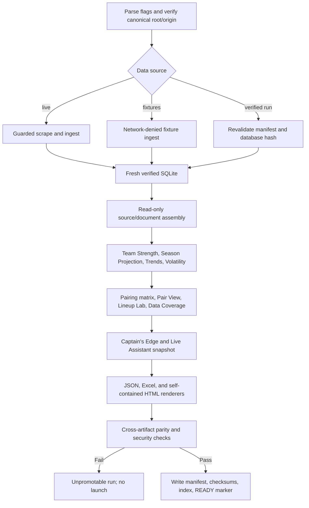

# Full Production Demo Builder

The Full Production Demo Builder is the proposed non-interactive orchestrator
that turns one authorized data source into one verified, immutable demo bundle.
It coordinates existing boundaries; it does not copy scraper, parser, ingest,
analytics, or renderer logic.

The planned entry point is `scripts/build_full_production_demo.py`. The existing
fixture-oriented `scripts/build_demo.py` remains a limited sample builder until
the full contract is implemented.

## Invocation

Exactly one data source is required:

```powershell
python scripts/build_full_production_demo.py --fixtures tests/fixtures/sample_pipeline --config tests/fixtures/ci_pipeline_config.yaml --out demo-runs/fixture

python scripts/build_full_production_demo.py --live --auth token-env --token-env APA_TOKEN --config apa_config.yaml --out demo-runs/live-2026-09-15

python scripts/build_full_production_demo.py --verified-run demo-runs/live-2026-09-15 --out demo-runs/rebuild-2026-09-15
```

`--live` and `--fixtures` delegate acquisition/ingest to the exact contract in
`scrape_and_ingest_pipeline.md`. `--verified-run` accepts only a prior run whose
manifest, database hash, schema checks, and promotable status revalidate. It
never accepts an arbitrary database path or silently falls back to the newest
file.

| Flag | Purpose |
| --- | --- |
| `--live` | opt in to authenticated APA acquisition |
| `--fixtures PATH` | select a manifest-backed fixture tree and deny network |
| `--verified-run PATH` | rebuild exports from one verified immutable run |
| `--auth ...` and credential-source flags | forwarded unchanged to the guarded acquisition CLI in live mode only |
| `--config PATH` | repository-local non-secret scope/export configuration |
| `--out PATH` | new, empty run directory within the canonical repository |
| `--team-id ID` | exact configured team override, retained as text |
| `--opponent-team-id ID` | optional exact demo scope restriction |
| `--format NAME`, `--session NAME` | optional exact scope restrictions |
| `--keep-raw` | forward the controlled capture-retention request in live mode |
| `--fail-on-warning` | promote selected warning classes to build failure |
| `--log-level info\|debug` | change redacted diagnostic detail, never payload content |

The builder does not expose `--serve`, `--open`, or browser flags. Presentation
belongs to the launcher after verification.

## Current status and implementation handoff

`scripts/build_full_production_demo.py` is not yet implemented. The existing
`scripts/build_demo.py` remains a sanitized-fixture illustration and must not be
renamed or treated as the production orchestrator: its independent fixtures do
not form one coherent season scope, and its HTML currently has external font
references. The production builder is a new coordination boundary over
existing acquisition, analytics, and export APIs—not a replacement for them.

Implementation must use these final contracts:

- parse exactly one of `--live`, `--fixtures`, or `--verified-run`;
- resolve config, source, output, and optional scenario paths beneath the
  canonical repository before any write or network action;
- create a new run directory and a separate exact temporary subdirectory;
- complete all database-writing population, including Player Trends, before
  recording and locking the database hash;
- construct each immutable analytics document once and inject it into all
  renderers; never re-read generated HTML/XLSX as an analytics source;
- write a phase-result record even for a declared optional unavailable feature;
- finalize checksums, manifest, and READY in that order, with READY last;
- leave failed runs unpromotable and never open or serve them.

The remaining-module cutover order after database lock is:

```text
canonical scope and rosters
  → Player-vs-Player rows + Match Difficulty cells
  → Team Strength + Season Projection + Trend document
  → Opponent Volatility profiles
  → Lineup Lab + Data Coverage
  → Captain's Edge descriptive composition + Live Assistant source/scenarios
  → HTML / Excel / JSON
  → parity, security, manifest, checksums, READY
```

Team Strength, Trend Analyzer, Opponent Volatility, heatmap, and Live Assistant
are required demo features once their implementation flag is enabled. Before
that cutover, the manifest may mark them `not_implemented`; it may not emit a
plausible placeholder artifact. Once enabled in release configuration, a build
failure is terminal and cannot be downgraded to optional at runtime.

## End-to-end flow



## Phase contract

1. **Preflight** verifies exact repository root/origin, clean contained output
   targets, argument exclusivity, config schema, dependencies, and mode policy.
2. **Acquire/ingest** delegates to the full scrape pipeline or its fixture path
   and requires a fresh/promotable database.
3. **Snapshot lock** records the database SHA-256 and opens it read-only for all
   later phases. A hash change during build fails the run.
4. **Core documents** build canonical roster/schedule scopes, Player-vs-Player
   matrix/pairs, Lineup Lab, Data Coverage, and persisted trend views.
5. **Extended documents** build Team Strength, Season Projection, Opponent
   Volatility, heatmap values, and the static Live Assistant source document.
6. **Render** passes each immutable document to its HTML/Excel/JSON renderer.
   Renderers do presentation only.
7. **Verify** reconciles keys, raw values, nulls, ordering, formulas/versions,
   workbook safety, HTML/script escaping, and absence of network references.
8. **Finalize** writes the redacted manifest/checksum list and an index only
   after every required gate passes.

## Exact analytics participants

- `analytics/team_stats.py` and implemented `analytics/team_strength.py`;
- `analytics/season_projection.py`;
- `analytics/player_trends.py` and implemented
  `analytics/opponent_volatility.py`;
- `analytics/pairing_evidence.py`;
- `analytics/player_vs_player_matrix.py` and
  `analytics/player_vs_player.py`;
- `analytics/lineup_lab.py` and `analytics/lineup_legality.py`;
- `analytics/data_coverage.py`;
- the descriptive Opponent Risk Profile document when implemented.

Legacy optimizer/scouting outputs may be packaged only under their existing
warnings and are not inputs to the validated captain-first path.

The module-specific query, renderer, and workbook boundaries are fixed in
`team_strength.md`, `trend_analyzer.md`, `opponent_volatility.md`,
`player_vs_player_matrix.md`, and `captains_live_assistant.md`. The consolidated
dependency and acceptance sequence is in `remaining_analytics_wiring_plan.md`.
Those documents control over any temptation to import a renderer's private
helper or derive a missing value in the orchestrator.

## Output bundle

```text
demo-runs/<run-id>/
├── demo_manifest.json
├── checksums.sha256
├── index.html
├── data/apa_tracker.db
├── html/
│   ├── captain_first_edge.html
│   ├── player_vs_player.html
│   ├── data_coverage.html
│   ├── team_strength.html
│   ├── season_projection.html
│   ├── trend_analyzer.html
│   ├── opponent_volatility.html
│   └── captains_live_assistant.html
├── excel/
│   ├── apa_stats.xlsx
│   ├── player_vs_player.xlsx
│   ├── data_coverage.xlsx
│   ├── team_strength.xlsx
│   ├── season_projection.xlsx
│   ├── trend_analyzer.xlsx
│   └── opponent_volatility.xlsx
└── json/ (optional parity documents)
```

The bundle excludes raw authenticated captures unless explicitly retained in a
separate protected run area. It always excludes credentials, cookies, browser
profiles, environment dumps, absolute user paths, and private debug payloads.
The local verified run contains its locked database for audit. A public/share
package omits that database unless an explicit privacy review authorizes it.

## Manifest and integration contract

`demo_manifest.json` is the machine-readable handoff between acquisition,
analytics, exports, CI, and the launcher. It contains a schema version, build
mode, run ID, repository revision, configuration hash, source/database hashes,
capture window, selected scopes, analytics formula versions, artifact relative
paths/hashes/row counts, warning and unavailable-data summaries, parity/security
gate results, and promotable status. Secret values, absolute user paths, raw
headers, and credential-source contents are forbidden.

Every phase accepts an explicit immutable input/result object and returns a
status plus relative artifacts. The builder invokes existing module APIs; it
does not import renderer internals or inspect browser state. Optional analytics
may produce an explicit unavailable document, but optionality is declared in
configuration before the run. A required/optional decision cannot change in
response to a failure.

The launcher may consume only a finalized manifest whose artifact hashes match
disk and whose repository/config/source identities match the requested run.
CI consumes the same manifest fields for parity assertions. This single
contract prevents the launcher, artifact index, and test harness from selecting
different outputs by filename convention or modification time.

## Failure and idempotency rules

- A phase failure stops every dependent phase; there is no stale-data fallback.
- Every run uses a new directory. No database/export is repaired or appended.
- A missing optional data document is represented by a manifest reason and an
  honest UI state, not a fabricated placeholder value.
- A missing required artifact, scope/hash mismatch, unsupported formula
  version, or cross-renderer mismatch makes the run unpromotable.
- Rebuilding the same verified inputs produces identical deterministic content
  after excluding manifest-declared run timestamps/IDs.
- Cleanup may remove only the exact temporary paths created for that run.

## Exit-code composition

Acquisition/ingest failures preserve the stable 2–9 and 130 categories defined
by `scrape_and_ingest_pipeline.md`. The full builder adds:

| Code | Category |
| ---: | --- |
| 10 | analytics/document construction or reconciliation failure |
| 11 | HTML/Excel/JSON render or cross-renderer parity failure |
| 12 | bundle manifest/checksum/finalization failure |

The first terminal category wins except secret-safety code 9, which supersedes
other failures if possible disclosure is detected. A stopped or failed run
never receives READY.

## Launcher handoff

Successful finalization writes `READY` only after manifest and checksum
verification. The launcher accepts the run directory, validates that marker and
manifest again, then serves or opens `index.html`. The builder never launches a
browser itself, preventing a partially verified run from being presented.

The READY marker contains only the manifest schema version, run ID, and
manifest SHA-256. Finalization writes the manifest and checksums first, flushes
them durably where supported, verifies them from disk, and writes READY last.
The launcher recomputes the manifest hash and all required artifact hashes; it
does not trust READY by presence alone.
