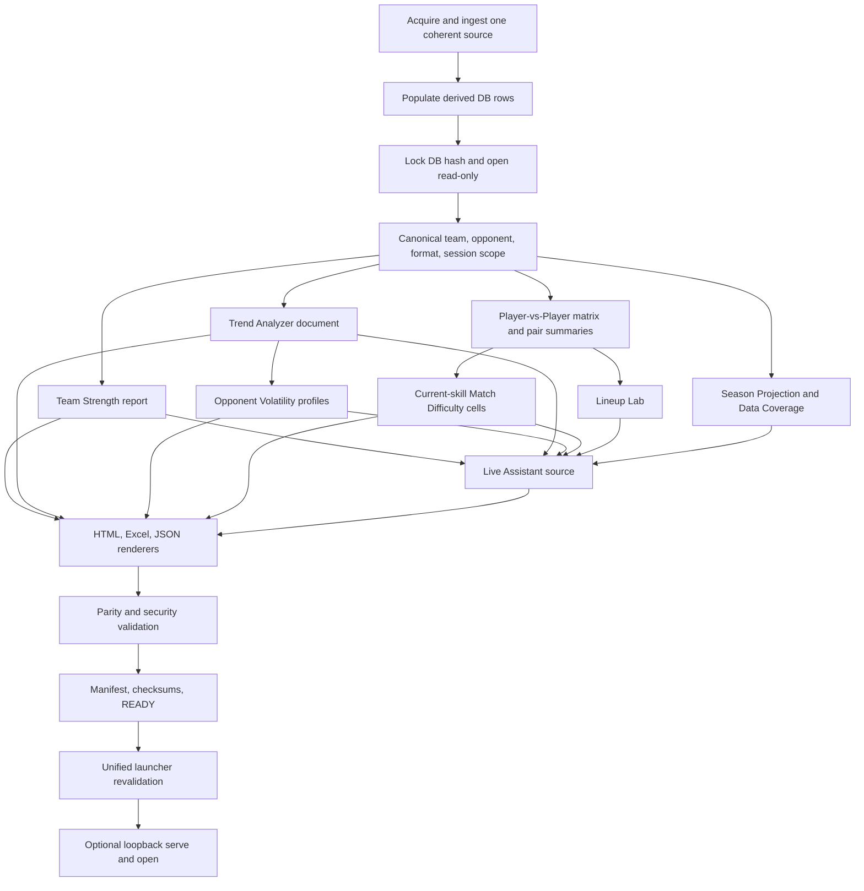

# Remaining analytics and demo wiring plan

This is the implementation handoff for the five remaining presentation
modules and the production builder/launcher that assembles them. It consolidates
the existing architecture and UX documents; it does not introduce new formulas,
scores, categories, or code paths.

## Repository status baseline

| Capability | Implemented baseline | Remaining wiring |
| --- | --- | --- |
| Team Strength | analytics, read-only exact-team/session builder, HTML fragment, three-sheet workbook, and focused tests | stricter identity/mixed-format guards, run provenance/script JSON, contained full-demo registration and parity |
| Trend Analyzer | formula/persistence path plus `analytics/trend_analyzer.py`, read-only dedicated builder, summary HTML, dedicated workbook, and tests | selected-player history chart/table, safe script JSON/routing, run provenance, full-demo registration/parity |
| Opponent Volatility Profile | pure profile, read-only roster/trend builder, summary HTML, two-sheet workbook, and focused tests | full accessible plot, missing-identity/multi-format guards, provenance, pair/live joins, and demo parity |
| Match Difficulty Heatmap | Player-vs-Player matrix, pair summaries, unified Pair/Matrix tab, two-sheet workbook | current-skill-only cells, heatmap/text view, two parity sheets, demo manifest fields |
| Captain's Edge Live Assistant | source analytics and Lineup Lab exist separately | scope reconciliation, local state reducer, static scenarios, offline HTML, optional session audit export |
| Full Production Demo Builder | component builders and fixture demo exist | one coherent run orchestrator, immutable manifest/checksums/READY, full parity and security gates |
| Unified Launcher | design only | strict flag forwarding, redacted events, verified-run validation, loopback serve/open |

“Implemented baseline” does not mean production-demo ready. A feature becomes
ready only when its source scope, immutable document, HTML, Excel where required,
manifest entry, tests, and cross-artifact parity all pass together.

## Dependency graph

All arrows carry explicit immutable objects or versioned manifest records.
No downstream consumer queries the database again, parses a generated artifact,
or fills a missing upstream value.

## Shared document envelope

Every module document carries:

- document schema and formula version;
- build run ID and source/database SHA-256;
- canonical team and opponent external IDs when applicable;
- normalized format, session, and division only when established;
- capture time and freshness status;
- canonical row keys and source row counts;
- unavailable reasons, warnings, and coverage denominators;
- deterministic initial order and any display-sort metadata.

The envelope is part of script JSON and the manifest. Excel places the same
fields in its summary sheet or a fixed metadata block. HTML displays the human-
relevant scope and provenance. A mismatch blocks the module and therefore the
production bundle once that module is required.

## Wiring sequence

1. Finish all database-writing derivations, including Player Trends, before
   locking the source hash.
2. Resolve the exact shared scope and canonical rosters once.
3. Build Team Strength from current team-history rows and eligible matches.
4. Build the immutable Trend Analyzer document from persisted aggregates and
   their chronological observations.
5. Build Opponent Volatility from the exact opponent roster plus matching trend
   rows; never import legacy danger classifications.
6. Build Player-vs-Player rows and current-skill-only difficulty cells with
   identical pair-key sets.
7. Build Lineup Lab and Data Coverage against those same identities.
8. Reconcile all source documents, then build the Live Assistant baseline and
   allowlisted static scenarios without a new blended score.
9. Render HTML, Excel, and optional parity JSON from the already-built objects.
10. Validate values, keys, nulls, order, formulas, escaping, workbook safety,
    offline behavior, and absence of categorical advice.
11. Write the manifest and checksums, re-read and verify them, then write READY.
12. Let the launcher independently verify the exact run before serving/opening.

## Cross-module UX contract

- Team Strength, Trend Analyzer, and Opponent Volatility are addressable tabs
  or artifact-index entries with exact scope and Data Coverage links.
- Player vs Player remains one tab with Pair View and Matrix View. The heatmap
  is a Matrix View visualization, not a third subview or top-level tab.
- Activating a heatmap cell opens that exact Pair View and preserves matrix
  state. Returning restores filters, axis order, and scroll position.
- The Live Assistant links to source tabs by stable row/pair keys. It never
  copies an unexplained score into a recommendation card.
- UNKNOWN and `No data` remain visible everywhere. Zero is never used for
  missing evidence, and missing difficulty is never displayed as 50.
- HOT/COLD are descriptive captured-skill directions; volatility descriptors
  are evidence states; neither becomes danger/favorable/Avoid/Target advice.

## HTML and Excel completion gates

| Module | HTML gate | Excel gate |
| --- | --- | --- |
| Team Strength | composite/components, roster and match evidence, proxy label, null gate, provenance | `Team_Strength`, `Team_Strength_Players`, `Team_Strength_Matches` |
| Trend Analyzer | summary, delivered trend score, real history chart/table, exact spans/gates | `Trend_Analyzer`, `Trend_History`; retain general `Player Trends` compatibility |
| Opponent Volatility | median/coverage, neutral numeric plot, complete roster including nulls | `Opponent_Volatility`, `Opponent_Volatility_Players` |
| Match Difficulty | fixed-bin accessible grid, text alternative, Pair View navigation, UNKNOWN separation | retain existing sheets and add `Match_Difficulty_Heatmap`, `Match_Difficulty_Data` |
| Live Assistant | offline availability/scenario UI, complete unassigned/UNKNOWN audit, descriptive notes | optional operator-triggered session workbook only; never a build-time inferred result |

All workbooks are values-only, macro-free, without external links, hidden
helpers, volatile formulas, or renderer-side analytics. Stable IDs are text;
null numeric cells stay blank with explicit status/reason fields.

## Builder and launcher acceptance

The production builder passes only when one coherent run supplies all enabled
modules, every artifact hash and row count matches the manifest, every cross-
artifact value matches before display rounding, HTML is self-contained and
escaped, workbook files load without repair, and no secret or absolute private
path appears. Required missing modules are terminal failures.

The launcher passes only when its flag matrix is valid, builder arguments are
forwarded as an array, logs/events are redacted, READY and all hashes revalidate,
the resolved index is inside the run root, the server binds loopback only, and
browser open occurs after the exact-run health check. It never repairs, builds,
selects the newest run, or changes retention state.

## Documentation-to-implementation traceability

- Team Strength: `team_strength.md`
- Trend Analyzer: `trend_analyzer.md`
- Opponent Volatility: `opponent_volatility.md`
- Heatmap and unified tab: `player_vs_player_matrix.md` and
  `player_vs_player_html_structure.md`
- Live Assistant: `captains_live_assistant.md`
- Orchestration: `full_production_demo_builder.md`
- Presentation wrapper: `demo_launcher.md`
- Artifact parity and demo gates: `demo_exports_plan.md`,
  `demo_testing_plan.md`, and `demo_assembly_checklist.md`

If implementation changes one of these public contracts, the same commit must
update its owning document and tests. Generated artifacts and `BUILD_INFO` are
not part of documentation-only changes.
