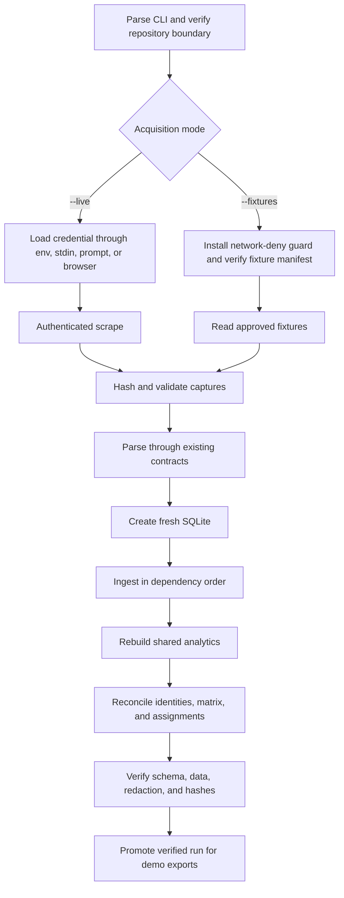
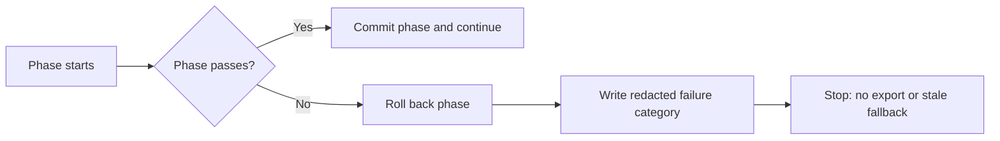

# Full APA scrape and ingest pipeline design

This document specifies a future production CLI for creating a fresh,
auditable APA Tracker snapshot. It is design-only. The command coordinates
existing authentication, scraper, parser, ingest, reconciliation, and
verification boundaries; it does not duplicate their logic.

## Command and modes

Proposed entry point:

```powershell
python scripts/scrape_and_ingest.py --live --config apa_config.yaml --out runs/2026-09-15
```

For deterministic rehearsal and CI:

```powershell
python scripts/scrape_and_ingest.py --fixtures tests/fixtures/sample_pipeline --config tests/fixtures/ci_pipeline_config.yaml --out runs/fixture
```

Exactly one acquisition mode is required:

- `--live` permits authenticated APA network requests;
- `--fixtures PATH` forbids network access and reads an approved fixture tree.

## CLI contract

| Flag | Purpose |
| --- | --- |
| `--config PATH` | Repository-local non-secret league/team configuration |
| `--out PATH` | New run directory inside the canonical repository |
| `--db PATH` | Optional database path inside the run directory; defaults to `apa.db` |
| `--live` | Explicit authorization for the production acquisition path |
| `--fixtures PATH` | Offline acquisition source; mutually exclusive with `--live` |
| `--credential-source env\|prompt\|browser` | Live authentication mechanism |
| `--token-env NAME` | Read a short-lived token from the named environment variable |
| `--token-stdin` | Read a token from standard input without echoing it |
| `--username-env NAME` | Environment variable containing the username |
| `--password-env NAME` | Environment variable containing the password |
| `--team-id ID` | Optional configured-team override, stored as text |
| `--opponent-team-id ID` | Optional scope restriction for rehearsal |
| `--format NAME` | Optional format restriction |
| `--session NAME` | Optional session restriction |
| `--dry-run` | Validate configuration/auth mechanism/output containment without login or writes |
| `--keep-raw` | Retain redacted raw captures in the run directory; off by default |
| `--verbose` | Emit operation names/counts only, never response bodies or secrets |

Raw values such as `--token VALUE`, `--password VALUE`, or credentials embedded
in a URL are intentionally unsupported because process lists and shell history
can expose them. Token, username/password, and browser-session modes are
mutually exclusive. An environment-variable *name* may be logged; its value may
not.

The command rejects a pre-existing non-empty output directory, a database
outside the run directory, a fixture/output path outside the canonical APA
Tracker boundary, an unrecognized origin, or a live request without `--live`.
It never repairs or appends to an old SQLite file.

## End-to-end flow

```text
preflight
  → authenticate (live only)
  → scrape/copy fixtures
  → validate and hash capture manifest
  → parse to typed rows
  → create fresh SQLite schema
  → ingest in dependency order
  → rebuild analytics aggregates
  → reconcile identities and coverage
  → verify schema/data/artifacts
  → write redacted run manifest
```





### 1. Preflight

Verify canonical repository root/origin, Python/dependencies, config schema,
mode exclusivity, contained output paths, free space, and expected parser
operation contracts. Create a unique run directory only after all read-only
checks pass.

### 2. Authenticate and scrape

Live mode delegates credentials/session state to `auth/` and acquisition to the
existing full scraper. The operator completes any guarded consent step. The CLI
records operation name, source entity IDs, HTTP/result status, byte count,
capture time, and SHA-256—not response bodies—in its normal log.

Fixture mode copies or reads only the selected approved fixture tree, verifies
its manifest/hashes, and installs a transport guard that fails any attempted
network call.

### 3. Parse and ingest

All captured payloads pass through existing parser contracts. The CLI creates a
new SQLite database from `database/models.py` and delegates writes to
`database/ingest.py`/`pipeline.ingest`. Dependency order is teams, current
rosters/team history, standings/schedules, scoresheets and pair history,
career/matchup aggregates, then H2H Advantage and Player Trends.

One database transaction is used per defined ingest phase. A failure rolls back
that phase and stops later phases. There is no silent partial-success demo.

### 4. Reconcile

Reconciliation verifies:

- external IDs are stable and unique within entity type;
- current `PlayerTeamHistory` rows include `team_external_id`;
- selected team/opponent/format/session scopes resolve unambiguously;
- scoresheet players and matches reference persisted identities;
- Stage 1 expected pair keys equal the current roster cross-product;
- DIRECT/INDIRECT/UNKNOWN counts sum to total feasible pairs;
- recognized W/L arithmetic and Lineup Lab assigned/unassigned counts reconcile;
- duplicate/conflicting same-match facts are reported, never arbitrarily won by
  insertion order.

### 5. Verify and finalize

Run schema, foreign-key, row-count, nullability, source-manifest, sensitive-data,
and focused analytics tests against the new database. Record the Git commit,
configuration hash, capture range, database hash, phase results, warnings, and
tool versions in a redacted manifest. Only a fully verified run is eligible for
demo export generation.

Stable exit-code categories should distinguish preflight, authentication,
acquisition, parse, ingest, reconciliation, verification, and secret-safety
failures. Logs name the category and remediation without exposing payloads.

## Credential and data safety

- Secrets are read at the last responsible moment, kept in memory, and removed
  from subprocess environments when no longer needed.
- Log/exception redaction covers tokens, cookies, authorization headers,
  usernames, passwords, query parameters, response snippets, and browser-state
  paths.
- Subprocesses receive argument lists, not interpolated shell strings.
- Raw authenticated payloads, cookies, profiles, and `.env` never enter Git or
  a public demo bundle.
- `--keep-raw` retains captures only inside the run directory under documented
  access/retention controls; it does not make them shareable.
- Authentication failure stops the run. There is no fallback to an old database
  or fixture mode.
- Cleanup targets only the exact run-created temporary paths and never a
  repository root or broad parent directory.

## CI policy

CI must always use `--fixtures`. A test harness removes credential variables,
installs a network-deny transport/socket guard, and fails on any attempted DNS,
HTTP, browser login, or APA endpoint access. Workflow definitions must not
contain production credentials, tokens, cookies, or persisted browser state.

The live path runs only as an operator-initiated production rehearsal in an
approved environment. Its result is documented by a redacted manifest and
artifact hashes, not by committing captured league data.

## Test strategy

### Unit tests

- argument/mode validation and stable exit codes;
- path containment and non-empty-output rejection;
- credential-source exclusivity, standard-input behavior, and redaction;
- manifest hashing/schema and deterministic warning order;
- phase rollback and fail-closed transitions.

### Mocked integration tests

- mock auth success, consent required, expiration, denial, rate limiting, and
  malformed GraphQL payloads;
- assert secrets never appear in captured logs/exceptions/subprocess arguments;
- verify scraper/parser/ingest calls and transaction order without live hits;
- simulate interruption and prove a partial database cannot be promoted.

### Fixture end-to-end tests

- ingest committed representative 8-ball/9-ball fixtures into a new temporary
  database;
- cover complete, missing-roster, UNKNOWN, duplicate/conflicting, stale-schema,
  hostile-text, and empty-history cases;
- rebuild Player vs Player Matrix, Pair View data, Lineup Lab, and Data Coverage;
- run twice and compare deterministic database facts/manifests after excluding
  explicitly variable run IDs/timestamps;
- assert the network guard observed zero live attempts.

### Live smoke test

Run manually with a short-lived credential, least-privilege account, unique
output directory, and approved retention window. Verify consent, scope counts,
reconciliation, redaction, manifest, and logout/session cleanup. This smoke test
is required for a production demo but is never part of CI.
